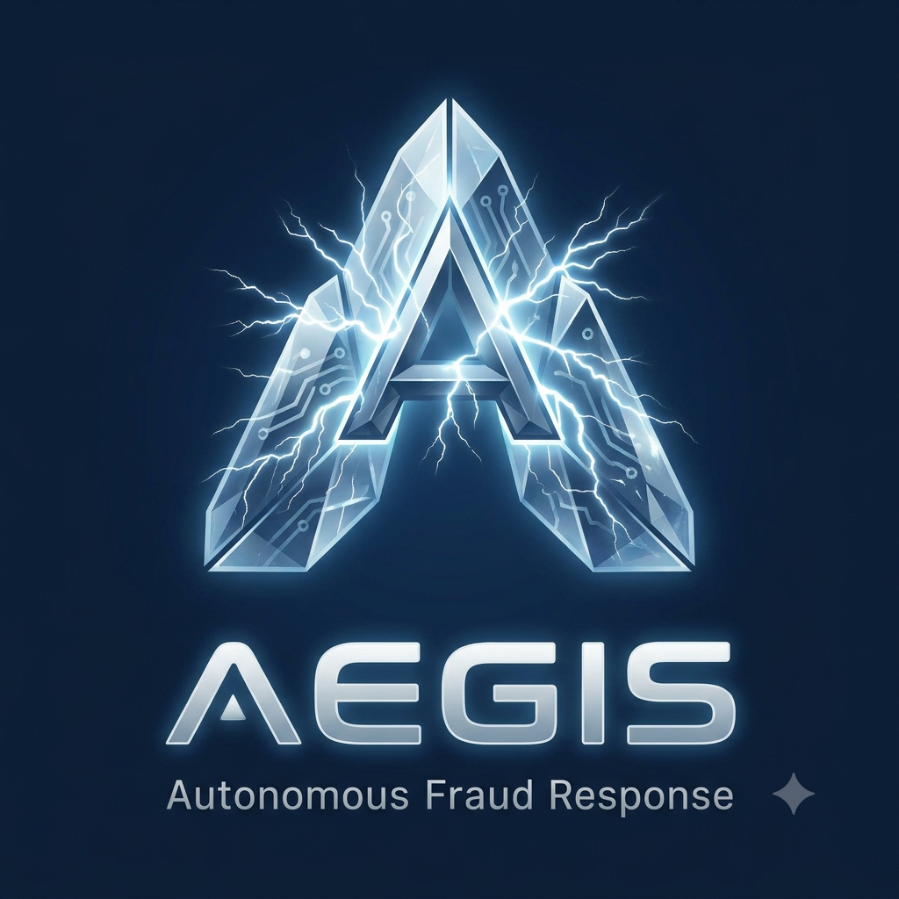
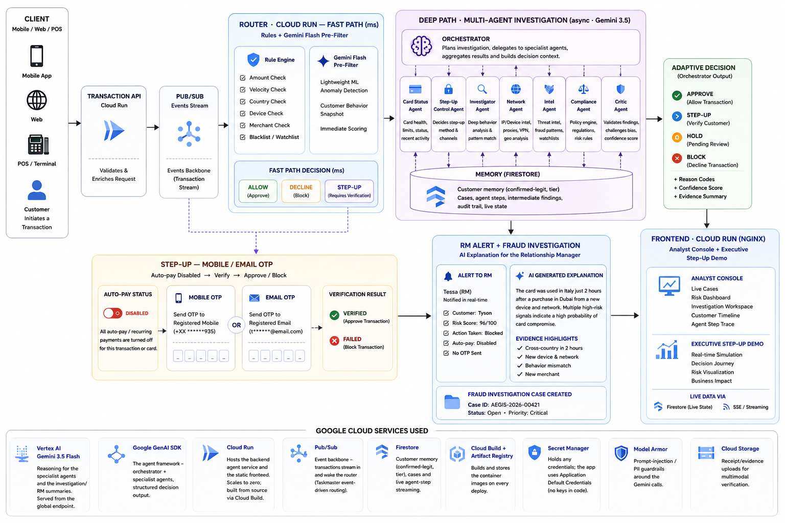
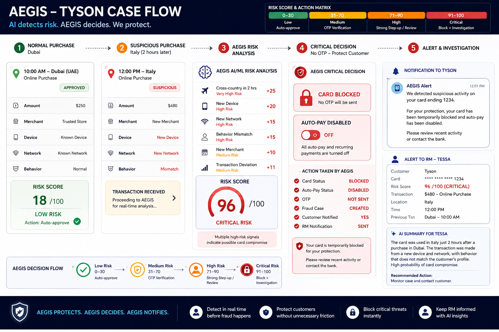

<div align="center">



# Aegis — AI Fraud Intelligence

**Autonomous, real-time fraud & financial-crime defense on Gemini + Google Cloud.**

Aegis doesn't just detect fraud — it *investigates*, *verifies the customer*, and blocks only when it must.

`Gemini 3.5` · `Google GenAI SDK` · `Cloud Run` · `Pub/Sub` · `Firestore` · `Secret Manager` · `Firebase Auth` · `React + TypeScript`

</div>

---

## What is Aegis?

Traditional rule engines ask *"is this transaction suspicious?"* — Aegis asks *"does this match the customer's normal identity, device, location and behaviour?"* If not, it **verifies the customer** (step-up OTP) instead of blocking them, and only hard-blocks confirmed fraud (e.g. a reported-stolen card).

A **multi-agent system on Gemini 3.5** runs the investigation: an Orchestrator delegates to specialist agents (Card Status, Step-Up Control, Investigator, Network, Intel, Compliance, Critic), each reasoning over evidence, then a memory- and policy-aware adaptive decision — with a relationship-manager alert and an AI-drafted case for high/critical risk.

## Scope

- **Real-time transaction risk decisioning** across card, wire and online channels.
- **Behavioural & contextual fraud detection** — device, network, geo-velocity, and history that rule thresholds miss.
- **Adaptive step-up authentication** (Mobile / Email OTP) that verifies the customer instead of declining them.
- **Multi-agent investigation & explainability** on Gemini 3.5, with an auto-drafted case and a relationship-manager alert.
- **Analyst console** (command center, live investigations, Customer 360, Compliance/SAR, Network Graph) and an **executive step-up walkthrough**.
- **Boundaries:** this build is a proof-of-concept on synthetic data — no real payments, card data, messages or core-banking integrations. The risk *decision* is made by the policy/risk engine; generative AI produces explanations only.

## Solution

Aegis runs a **two-speed architecture**:

1. **Fast path (milliseconds)** — a rules + Gemini Flash pre-filter clears the ~90% of benign traffic and makes the instant allow / decline / step-up call.
2. **Deep path (seconds, async)** — only genuinely suspicious transactions wake a **multi-agent investigation on Gemini 3.5**. An Orchestrator delegates to seven specialist agents, weighs **customer memory** (confirmed-legit patterns), applies **policy gates** (stolen-card hard block, auto-pay + OTP, VIP handling), and returns an adaptive decision with reason codes, a confidence score and an evidence summary.

For high/critical risk it **disables auto-pay, requests OTP, and alerts the relationship manager** with an AI-generated explanation. A stolen card is blocked regardless of tier; a VIP is never cold-declined.

## Reference architecture



The **risk engine / policy makes the decision** — generative AI is used only for investigation summaries and explanations, never to authorize the payment.

## The Tyson case flow



A normal Dubai purchase auto-approves (risk 18). Two hours later the same card is used in Italy — new device, new network, behaviour mismatch → risk 82. Instead of blocking, Aegis **disables auto-pay, requests OTP, and alerts RM Tessa**. Verify → approve; no OTP → block. A reported-stolen card in a new country → risk 97 → **hard block + fraud case** (OTP cannot override a stolen card).

## Results — measured on a synthetic benchmark

Aegis's real decision policy vs. a traditional rules-only engine, over **276 labeled transactions** (`backend/eval/evaluate.py`):

| Metric | Rules-only | **Aegis** |
|---|---|---|
| Fraud caught (recall) | 12.7% | **95.2%** |
| Hard false-decline rate | 39.0% | **3.8%** |
| Block precision | 8.8% | **88.2%** |

- **Caught 95.2% of fraud** vs. 12.7% for rules-only — AI catches the stolen-card, account-takeover and impossible-travel cases blunt rules miss.
- **Cut hard false declines by ~90%** (39% → 3.8%) — memory approves confirmed-legit activity and a lightweight OTP step-up replaces most declines.
- Every decision is automated (approve / step-up / block) in seconds — no manual analyst triage queue.

Reproduce: `python backend/eval/evaluate.py`. Illustrative on synthetic data; production thresholds are calibrated on the bank's historical fraud / false-positive data.

## Benefits for banking

- **Recovered revenue** — banks lose more to *false declines* than to actual card fraud; cutting them ~90% turns declined-but-legitimate spend back into approved transactions and keeps customers loyal.
- **Lower fraud losses** — behavioural, device and network signals catch sophisticated fraud (stolen card, account takeover, impossible travel) that static rules approve.
- **Better customer experience** — verify, don't block: a quick OTP replaces an embarrassing decline; VIPs get white-glove handling and are never cold-declined.
- **Analyst efficiency** — every case is auto-investigated and explained in seconds, with an AI-drafted narrative; analysts review, they don't triage from scratch.
- **Relationship-manager insight** — high-risk activity raises an RM alert with a plain-language explanation, so the bank protects the client and the relationship at once.
- **Explainable & auditable** — reason codes, confidence and an evidence chain on every decision support model-risk governance and regulatory review.
- **Elastic & cost-aware** — scales to zero on Cloud Run; a cheap pre-filter means Gemini only runs on the small fraction of transactions that need deep analysis.

## Key capabilities

- **Multi-agent investigation** on Gemini 3.5, streamed live into the analyst console
- **Memory that stops false declines** — recalls confirmed-legit patterns so it never re-challenges the same activity
- **Risk matrix policy** — Low → auto-approve · Medium → OTP · High → step-up + RM alert · Critical → block + investigation
- **Step-up, not block** — auto-pay disabled → Mobile/Email OTP → verify or block
- **VIP handling** — a false decline costs more than the fraud, so VIPs are never cold-declined; a stolen card is blocked regardless of tier
- **Interactive architecture explorer** — hover/click any Google Cloud service to zoom in and read what it does
- **Analyst console** — command center, auto-launching investigations, Customer 360, Compliance/SAR, Network Graph, Architecture
- **Executive step-up walkthrough** — a presentable, self-contained journey

## Monorepo layout

```
project/
├── frontend/     # React + TypeScript + Tailwind — analyst console + executive walkthrough
├── backend/      # FastAPI + Google GenAI SDK + Gemini 3.5 — multi-agent investigation
├── infra/        # GCP setup + Cloud Run deploy scripts + Secret Manager
├── simulator/    # Pub/Sub transaction publisher
└── AEGIS-ROADMAP.md
```

## Google Cloud services

| Service | Role |
|---|---|
| **Vertex AI — Gemini 3.5** | Reasoning for the specialist agents + investigation/RM summaries (global endpoint) |
| **Google GenAI SDK** | Agent framework — orchestrator + specialists, structured decision output |
| **Cloud Run** | Hosts the backend agent service and the static frontend (scales to zero) |
| **Pub/Sub** | Event backbone — transactions stream in and wake the router |
| **Firestore** | Customer memory (confirmed-legit, tier), cases, live agent-step streaming |
| **Secret Manager** | Firebase web config **and the Gemini API key** — single source of truth, injected at build/runtime |
| **Cloud Build + Artifact Registry** | Builds and stores container images on every deploy |
| **Model Armor** | Prompt-injection / PII guardrails around the Gemini calls |
| **Cloud Storage** | Receipt / evidence uploads for multimodal verification |
| **Firebase Authentication** | Sign-in / sign-up (email-password + Google); a guest mode needs no account |

---

## Run it locally

### Prerequisites
- **Node.js 20+**
- **Python 3.12+** (only if you want to run the backend locally)

### 1) Frontend (talks to the deployed backend by default)
```bash
cd frontend
npm install
```
Create `frontend/.env` from the example and fill in your Firebase web config:
```bash
# frontend/.env  (see frontend/.env.example)
VITE_FIREBASE_API_KEY=...
VITE_FIREBASE_AUTH_DOMAIN=your-project.firebaseapp.com
VITE_FIREBASE_PROJECT_ID=your-project
VITE_FIREBASE_STORAGE_BUCKET=your-project.firebasestorage.app
VITE_FIREBASE_MESSAGING_SENDER_ID=000000000000
VITE_FIREBASE_APP_ID=1:000000000000:web:xxxxxxxx
VITE_API_URL=https://<your-backend>.run.app
```
Start it:
```bash
npm run dev
```
Open **http://localhost:5173** → sign in with Firebase, or **continue as guest** (no account needed).

### 2) Backend ( — runs offline, deterministic, no cloud)
```bash
cd backend
pip install -r requirements.txt
# PowerShell:
$env:AEGIS_OFFLINE="true"; uvicorn app:app --reload --port 8080
# bash:
AEGIS_OFFLINE=true uvicorn app:app --reload --port 8080
```
Point the frontend at it by setting `VITE_API_URL=http://localhost:8080` in `frontend/.env`, then restart `npm run dev`.
To run against **live Gemini** locally: `gcloud auth application-default login`, drop `AEGIS_OFFLINE`, and set `GOOGLE_CLOUD_PROJECT` / `GOOGLE_CLOUD_LOCATION=global` / `GEMINI_MODEL=gemini-3.5-flash`.

---

## Deploy to Google Cloud — detailed steps

All scripts build **from source via Cloud Build** — no local Docker needed. Run them from the repo root; **Cloud Shell** works out of the box (gcloud is pre-installed and authenticated).

**Step 0 — one-time in the Cloud Console:** create a project, link a billing account, and note the `PROJECT_ID`.

**Step 1 — provision the project.** Enables the APIs and creates Firestore, Pub/Sub topics, the Storage bucket, the Artifact Registry repo, and the least-privilege service accounts (`aegis-runtime`, `aegis-sim`):
```bash
export PROJECT_ID=<your-project-id>
bash infra/setup.sh
```

**Step 2 — store the Gemini API key in Secret Manager.** Skip this to use Vertex AI via the runtime service account (no key). To use a Gemini API key instead — stored in Secret Manager and mounted to Cloud Run at runtime:
```bash
PROJECT_ID=$PROJECT_ID GEMINI_API_KEY=<your-gemini-api-key> bash infra/set-gemini-secret.sh
```

**Step 3 — deploy the backend to Cloud Run** (Gemini 3.5-flash on the global endpoint; mounts the Gemini key secret if present):
```bash
PROJECT_ID=$PROJECT_ID bash infra/deploy.sh
```
It prints the backend URL and a `curl` health/investigate test.

**Step 4 — store the frontend config in Secret Manager.** Create `frontend/.env` with your `VITE_FIREBASE_*` values, then:
```bash
PROJECT_ID=$PROJECT_ID bash infra/set-firebase-secret.sh
```

**Step 5 — deploy the frontend to Cloud Run** (nginx; fetches the Firebase config from Secret Manager and bakes it into the build):
```bash
PROJECT_ID=$PROJECT_ID bash infra/deploy-frontend.sh
```
It prints the live URL: the analyst console at `/` and the executive walkthrough at `/#fraud-journey`.

**Step 6 — enable Firebase sign-in** (once): in the Firebase console → Authentication → Sign-in method, enable **Email/Password** (and Google); under Settings → Authorized domains, add your Cloud Run domain. *(Guest login works without this.)*

---

## Details stored in Secret Manager

Sensitive config is held in **Secret Manager** as the single source of truth — never hardcoded in committed source.

**1. Frontend config — secret `firebase-config`** (Firebase web keys + backend URL):
- Values live in `frontend/.env` locally (gitignored).
- `infra/set-firebase-secret.sh` stores that file as the secret.
- `infra/deploy-frontend.sh` fetches it and injects it into the build, then bakes it into the SPA.

> Firebase **web** keys are not secret — they identify the project and ship to the browser to initialize Firebase; security comes from Firebase Auth + rules. Secret Manager keeps them out of committed source and centralizes them.

**2. Gemini API key — secret `gemini-api-key`** :
- By default the backend authenticates to **Vertex AI** via the `aegis-runtime` service account (Application Default Credentials) — **no key in code**.
- To use a Gemini API key instead, store it with `infra/set-gemini-secret.sh`. `infra/deploy.sh` detects the secret and **mounts it to Cloud Run at runtime** as `GEMINI_API_KEY` — it never appears in the repo, the image, or the frontend.

## Authentication

- **Firebase Auth** — email/password + Google sign-in. Enable the providers in the Firebase console and add your domains under Authorized domains.
- **Guest mode** — enter a name and proceed; no Firebase setup required.

---

## Conclusion

Aegis reframes fraud defense from *"block anything suspicious"* to *"verify the customer, block only real fraud."* By pairing a fast rules/Flash pre-filter with a Gemini 3.5 multi-agent investigation, customer memory, and adaptive step-up, it catches the sophisticated fraud that rules miss **and** cuts the false declines that cost banks revenue and trust — on the benchmark, **95% of fraud caught and ~90% fewer false declines**. It runs end-to-end on Google Cloud (Cloud Run, Pub/Sub, Firestore, Vertex AI, Secret Manager), scales to zero, keeps every secret in Secret Manager, and explains every decision — giving a bank both stronger protection and a better customer experience from the same event.

## Creator

**Deepan** — Cloud Architect · [deepantechnoids.github.io](https://deepantechnoids.github.io/)

## Disclaimer

Proof-of-concept. Simulated transactions, risk scoring and OTP — no real payments, messages, or banking integrations. All data is synthetic.
